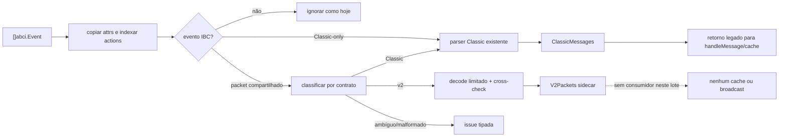

# M1.1a — desenho da ingestão lossless e action-indexed

Data da análise: 2026-07-15  
Escopo: análise de desenho; nenhum arquivo de produção foi alterado.

## Resultado executivo

A menor inserção segura é substituir somente o interior de
`chains.IbcMessagesFromEvents` por um parser de lote que:

1. lê `abci.Event` diretamente e copia atributos, em ordem, antes de chamar
   qualquer projeção do SDK;
2. correlaciona `msg_index` com o evento `message` que contém o atributo bruto
   `action`;
3. classifica os cinco event types de packet pelo conjunto completo de
   atributos exclusivos Classic/v2;
4. mantém mensagens Classic no retorno legado e coloca observações v2 apenas
   em um sidecar novo;
5. nunca entrega esse sidecar a `handleMessage`, `PacketFlow`, `ChannelKey`,
   cache, state machine ou broadcast neste lote.

Isso fecha a colisão de nomes entre Classic e v2 sem alterar o fluxo Classic
válido. `ParseIBCMessageFromEvent` também deve deixar explícito que packet é
Classic-only e recusar atributos v2, pois hoje ele é exportado e seleciona
`PacketInfo` apenas por `event.Type`.

## Evidência fixada

### Emissão IBC v2 no tag alvo

O código exato de
[`ibc-go/v11.2.0`](https://github.com/cosmos/ibc-go/blob/v11.2.0/modules/core/04-channel/v2/keeper/events.go)
emite os mesmos cinco nomes usados por Classic:

`send_packet`, `recv_packet`, `write_acknowledgement`,
`acknowledge_packet`, `timeout_packet`.

Todos os cinco carregam, nesta ordem:

- `packet_source_client`;
- `packet_dest_client`;
- `packet_sequence`;
- `packet_timeout_timestamp` (segundos);
- `encoded_packet_hex` (protobuf `ibc.core.channel.v2.Packet`).

`write_acknowledgement` acrescenta
`encoded_acknowledgement_hex` (protobuf
`ibc.core.channel.v2.Acknowledgement`). As constantes estão no
[`events.go` de types](https://github.com/cosmos/ibc-go/blob/v11.2.0/modules/core/04-channel/v2/types/events.go)
e o wire schema está em
[`packet.proto`](https://github.com/cosmos/ibc-go/blob/v11.2.0/proto/ibc/core/channel/v2/packet.proto).

### Emissão Classic atual

O `ibc-go/v8.2.0` pinado em `go.mod` usa os mesmos nomes, mas o contrato comum
de packet contém:

- `packet_src_port`, `packet_src_channel`;
- `packet_dst_port`, `packet_dst_channel`;
- `packet_sequence`, `packet_timeout_height`,
  `packet_timeout_timestamp`;
- opcionalmente, conforme o evento, `packet_data_hex`, `packet_ack_hex`,
  `packet_channel_ordering` e `connection_id`.

Portanto, nome e os dois atributos compartilhados (`packet_sequence` e
`packet_timeout_timestamp`) não discriminam protocolo.

### Correlação de mensagem no Cosmos SDK

No SDK 0.50.11 atual e no SDK 0.54.x requerido pelo alvo, BaseApp:

1. cria primeiro um evento `message` com atributo bruto `action` igual ao type
   URL da mensagem;
2. antepõe esse evento aos eventos retornados pelo handler;
3. acrescenta `msg_index` a **todos** os eventos daquela mensagem.

O comportamento pode ser verificado em
[`baseapp.go` do SDK v0.54.0](https://github.com/cosmos/cosmos-sdk/blob/v0.54.0/baseapp/baseapp.go).
O nome consultável `message.action` é a composição `eventType.key`; dentro do
`abci.Event`, a chave continua sendo apenas `action`.

Há ainda eventos `message` emitidos pelo keeper de IBC com somente `module`.
Eles não são delimitadores de mensagem e não podem apagar a action corrente.

## Problema no código atual

`relayer/chains/parsing.go` faz, para cada evento:

```go
evt := sdk.StringifyEvent(event)
m := ParseIBCMessageFromEvent(log, evt, chainID, height)
```

Essa sequência tem três defeitos para M1.1a:

- `sdk.StringifyEvent` remove `EventAttribute.Index`;
- a correlação entre eventos e `message.action` não é construída;
- o `switch event.Type` transforma qualquer packet v2 em `PacketInfo`
  Classic parcialmente vazio.

Esse último valor chega a `cosmos.handlePacketMessage` ou
`penumbra.handlePacketMessage`, onde seria convertido em `ChannelKey` e poderia
ser retido no `PacketFlow`. Os consumidores atuais são:

- `relayer/chains/cosmos/cosmos_chain_processor.go` (FinalizeBlock e txs);
- `relayer/chains/penumbra/penumbra_chain_processor.go` (FinalizeBlock e txs);
- `relayer/chains/cosmos/query.go` (block search e tx search);
- `relayer/chains/penumbra/query.go` (tx search).

## API proposta

Manter a assinatura pública existente e adicionar uma API rica ao lado dela:

```go
type IBCEventBatch struct {
    Envelopes       []protocol.EventEnvelope
    ClassicMessages []IbcMessage
    V2Packets       []V2PacketEvent
    Issues          []IBCEventIssue
}

type V2PacketEvent struct {
    Event           protocol.EventEnvelope
    Observation     protocol.PacketObservation
    Acknowledgement *protocol.Acknowledgement
}

type IBCEventIssue struct {
    EventIndex uint32
    EventType  string
    Err        error
}

type IBCEventMetadata struct {
    ChainID string
    Height  uint64
    TxHash  string
}

func ParseIBCEventBatch(
    log *zap.Logger,
    events []abci.Event,
    metadata IBCEventMetadata,
) IBCEventBatch
```

`Acknowledgement` é `nil` fora de `write_acknowledgement`. Para v2, ela contém
o resultado tipado (`AppAcknowledgements`) do protobuf. O
`PacketObservation.Acknowledgement` não deve receber os bytes do protobuf
agregado: isso confundiria wire container com app acknowledgement. Se o lote
precisar preservar também o wire exato, acrescentar
`EncodedAcknowledgement []byte` em `V2PacketEvent`, sempre com cópia defensiva.

Compatibilidade:

```go
func IbcMessagesFromEvents(
    log *zap.Logger,
    events []abci.Event,
    chainID string,
    height uint64,
) []IbcMessage {
    batch := ParseIBCEventBatch(log, events, IBCEventMetadata{
        ChainID: chainID,
        Height:  height,
    })
    logIBCEventIssues(log, batch.Issues)
    return batch.ClassicMessages
}
```

Assim os seis consumidores existentes continuam recebendo somente a forma
Classic. Um consumidor v2 só poderá ser conectado conscientemente, em lote
posterior, chamando `ParseIBCEventBatch` e usando `V2Packets`.

## Construção lossless do envelope

Para cada evento classificado como IBC:

```go
protocol.EventEnvelope{
    Protocol:   classifiedProtocol,
    Type:       event.Type,
    Height:     metadata.Height,
    TxHash:     metadata.TxHash,
    EventIndex: uint32(position),
    Action:     correlatedAction,
    Attributes: cloneABCIAttributes(event.Attributes),
}
```

`cloneABCIAttributes` deve fazer um append por atributo para preservar:

- ordem do evento;
- chaves repetidas;
- valores repetidos;
- strings vazias até a validação de contrato;
- `Index` individual.

Não usar `map[string]string`, `sdk.StringifyEvent` ou normalização antes dessa
cópia. Uma multimap/índice auxiliar pode conter posições dos atributos, mas o
slice original clonado permanece a fonte da verdade.

`metadata.TxHash` é opcional porque `BlockResults.TxsResults` não carrega hash
no fluxo atual. Isso não deve bloquear M1.1a; tx search já possui hash e uma
integração posterior pode preenchê-lo. `EventIndex` e `Action.Index` já dão
identidade determinística dentro do lote.

## Algoritmo action-indexed

Aplicar duas passagens para eventos com índice e um fallback monotônico para
resultados legados sem índice.

### Passagem 1 — índice de actions

Para todo evento `message`:

1. obter todos os valores da chave bruta `action`;
2. ignorar o evento se não houver action (é o evento `module` do keeper);
3. aceitar valores duplicados somente se forem idênticos e não vazios;
4. obter `msg_index` sob a mesma regra de singleton idêntico;
5. se o índice existir, parsear em `uint32` e registrar
   `index -> actionType`;
6. se o mesmo índice aparecer com actions diferentes, marcar o índice como
   conflituoso; nenhum evento desse índice recebe uma action.

### Passagem 2 — correlação por evento

Para cada evento na ordem original:

1. se há um `msg_index` válido, usar somente a action indexada correspondente;
2. se `msg_index` está ausente, usar a última action sem índice observada antes
   do evento (compatibilidade com resultados antigos);
3. nunca correlacionar para frente pelo fallback;
4. nunca trocar a action corrente por evento `message` que só contenha
   `module`;
5. se não houver action, produzir `MessageAction{Present:false}` — eventos de
   FinalizeBlock podem legitimamente não pertencer a uma tx;
6. índice inválido, duplicado conflitante ou action conflitante gera issue
   tipada, sem adivinhar correlação.

Uma action ausente não torna o envelope inválido. O consumidor de tx que
precisar dessa garantia chama `EventEnvelope.RequireAction()`. Uma correlação
explicitamente inválida deve impedir a criação do sidecar v2, mas não deve
remover uma mensagem Classic válida do retorno legado; nesse caso a issue é
reportada e o comportamento Classic permanece compatível.

## Contrato de classificação Classic versus v2

### Famílias de atributos

Exclusivos Classic:

```text
packet_src_port packet_src_channel packet_dst_port packet_dst_channel
packet_timeout_height packet_data packet_data_hex packet_ack packet_ack_hex
packet_channel_ordering packet_connection
```

Exclusivos v2:

```text
packet_source_client packet_dest_client
encoded_packet_hex encoded_acknowledgement_hex
```

Compartilhados:

```text
packet_sequence packet_timeout_timestamp connection_id msg_index
```

### Regras

1. Aplicar classificação de packet apenas aos cinco event types compartilhados.
2. Se houver qualquer atributo de ambas as famílias exclusivas, retornar
   `ErrAmbiguousPacketProtocol`; não usar action, prefixo configurado ou nome
   do evento para desempatar.
3. Se houver apenas família Classic, exigir exatamente uma ocorrência de:
   `packet_src_port`, `packet_src_channel`, `packet_dst_port`,
   `packet_dst_channel`, `packet_sequence`, `packet_timeout_height` e
   `packet_timeout_timestamp`.
4. Se houver apenas família v2, exigir exatamente uma ocorrência de:
   `packet_source_client`, `packet_dest_client`, `packet_sequence`,
   `packet_timeout_timestamp` e `encoded_packet_hex`.
5. Para `write_acknowledgement` v2, exigir também exatamente um
   `encoded_acknowledgement_hex`; nos outros quatro eventos, sua presença é
   contrato inválido.
6. Campo requerido repetido, ainda que com valor igual, é rejeitado no
   contrato de packet. O envelope continua preservando a duplicata para
   diagnóstico, mas não se aplica semântica last-write-wins.
7. Atributos adicionais desconhecidos são preservados e permitidos para
   forward compatibility, desde que não pertençam à família oposta.
8. Sem atributos exclusivos ou com contrato incompleto, retornar
   `ErrMalformedPacketEvent`; não fabricar `PacketInfo` vazio.

Essa classificação usa o contrato completo de identidade do packet. A
validação de valor (`uint64`, hex, protobuf, correspondência entre campos
redundantes) ocorre depois e não altera a classificação.

### Consistência após o decode v2

Depois de decodificar `encoded_packet_hex`, comparar **todos** os campos
redundantes do evento com o protobuf:

- source client;
- destination client;
- sequence;
- timeout timestamp.

Qualquer divergência retorna `ErrPacketEventMismatch`. O protobuf validado é a
fonte da `PacketObservation`; os atributos permanecem evidência bruta. Para
ack, decodificar o protobuf agregado, validar a quantidade/tamanho de app acks
e preservar cópias defensivas.

## Erros tipados

Definir sentinelas para `errors.Is`, envolvendo contexto sem incluir payloads
hex completos:

```go
var (
    ErrAmbiguousPacketProtocol = errors.New("ambiguous packet protocol")
    ErrMalformedPacketEvent    = errors.New("malformed packet event")
    ErrInvalidMessageIndex     = errors.New("invalid message index")
    ErrConflictingMessageIndex = errors.New("conflicting message index")
    ErrConflictingMessageAction = errors.New("conflicting message action")
    ErrMessageActionRequired   = errors.New("message action required")
    ErrPacketEventMismatch     = errors.New("packet event does not match encoded packet")
)
```

O decoder v2 deve acrescentar sentinelas próprias para hex de tamanho
excessivo, hex inválido e protobuf inválido. `IBCEventIssue` guarda posição e
tipo; logs devem informar comprimento/digest, não o valor hex recebido.

## Fluxo seguro de parsing



Para alimentar o parser Classic, converter o envelope já copiado para
`sdk.StringEvent` somente depois de correlação/classificação. Isso conserva o
parser legado sem perder a representação lossless mantida em `Envelopes`.

## Casos-limite obrigatórios

| Caso | Resultado |
|---|---|
| dois `message.action`, índices 0 e 1, eventos intercalados | correlação por `msg_index`, não pela proximidade |
| evento `message` do keeper apenas com `module` | não muda action |
| evento de FinalizeBlock sem action/index | envelope com `Action.Present=false` |
| `msg_index` ausente em formato legado | última action anterior sem índice |
| `msg_index=-1`, overflow ou não decimal | issue `ErrInvalidMessageIndex`; sem sidecar v2 |
| dois `msg_index` diferentes no mesmo evento | issue de conflito; nunca escolher o último |
| mesmo índice com actions diferentes | todos os eventos desse índice sem action; issue |
| duplicata de atributo requerido de packet | contrato malformado, mesmo se valores iguais |
| evento com roteamento Classic e clients/encoded v2 | ambíguo; sem Classic e sem v2 |
| event type compartilhado sem discriminadores | malformado; não cria `PacketInfo` vazio |
| v2 hex válido, protobuf inválido | issue de decode; sem observação |
| protobuf válido, sequence/clients/timeout divergentes | `ErrPacketEventMismatch` |
| `encoded_acknowledgement_hex` fora de write ack | contrato v2 inválido |
| v2 válido sem action | observável como evento não correlacionado; `RequireAction` falha quando exigido |
| atributos desconhecidos adicionais | preservados e aceitos |

## Divisão de arquivos e limite de complexidade

Para manter complexidade ciclomática e cognitiva abaixo de 10 por função:

- `relayer/chains/event_envelopes.go`: cópia lossless, singleton helpers e
  correlação;
- `relayer/chains/packet_event_classifier.go`: conjuntos de chaves e validação
  de contratos;
- `relayer/chains/v2_event_parser.go`: decode/cross-check para sidecar;
- `relayer/chains/parsing.go`: somente orquestração e compatibilidade Classic;
- testes separados por responsabilidade.

Evitar uma única função com loops, switch de event type, classificação,
decode e logging. Cada helper deve ter uma saída explícita e, no máximo, um
eixo de decisão.

## Sequência de implementação recomendada

1. Adicionar testes da cópia raw e do correlator, sem tocar no parser Classic.
2. Adicionar classificador puro e matriz dos cinco eventos.
3. Adicionar decoder v2 limitado e goldens produzidos pelo tag exato v11.2.0.
4. Criar `ParseIBCEventBatch` e testar que v2 aparece só no sidecar.
5. Trocar o interior de `IbcMessagesFromEvents` pelo adaptador de compatibilidade.
6. Tornar `ParseIBCMessageFromEvent` packet-safe para que chamada direta com
   attrs v2 retorne `nil` e uma issue/log controlado.
7. Rodar regressão dos seis consumidores sem ligar `V2Packets` a nenhum deles.

## Critérios de aceite deste desenho

- todos os atributos ABCI classificados sobrevivem byte/string-equivalentes,
  na mesma ordem, com duplicatas e `Index`;
- multi-message tx correlaciona pelo `msg_index` real;
- os cinco nomes colidentes nunca bastam para selecionar protocolo;
- um evento v2 não pode produzir `*chains.PacketInfo`;
- todas as mensagens Classic válidas dos testes existentes permanecem iguais;
- os consumidores existentes recebem exclusivamente `ClassicMessages`;
- nenhuma referência nova a processor/cache/broadcast aparece no parser v2;
- todas as funções novas/tocadas medem no máximo 9 de complexidade
  ciclomática e cognitiva.
